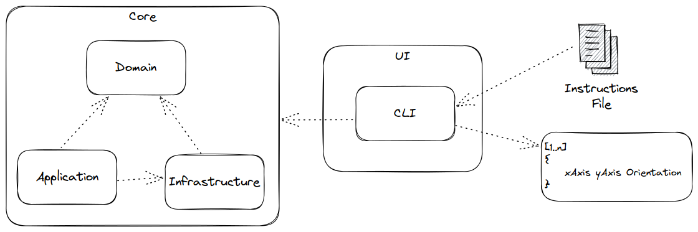

# Mars Robot Challenger

## Overview



## Steps

I started this project with the entities and emphasising rich domain and using TDD to driven the code. 

---

## How to Run?

```shell
sh run.sh
```

### On Docker

!!!!!!!! Copy the data file(txt) to same directory of .sh file !!!!!!!!

When asked just fill the filename, example 'Data.txt'

```shell
sh run-at-docker.sh
```

---

## How to run Tests

```shell
sh run-tests.sh
```

### On Docker

```shell
sh run-tests-at-docker.sh
```